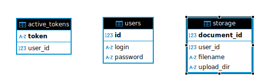
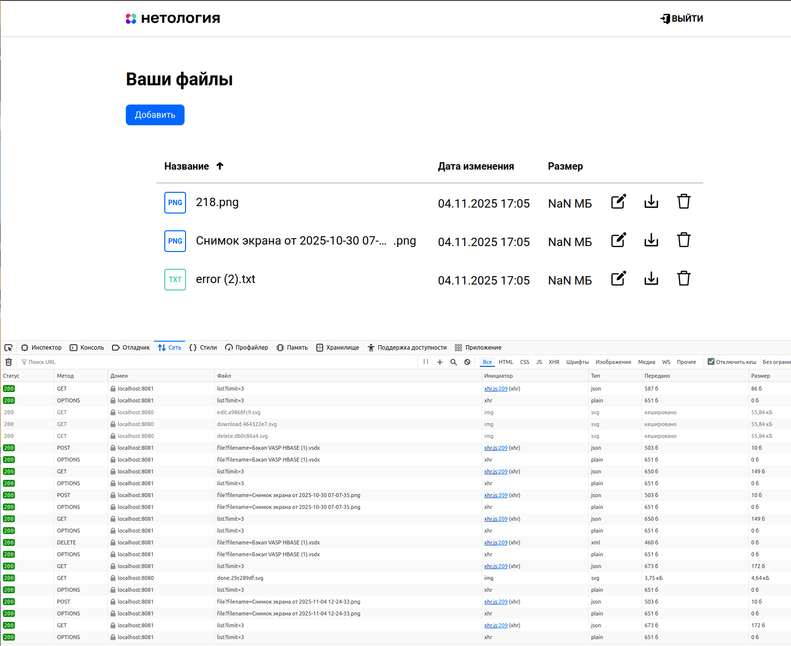
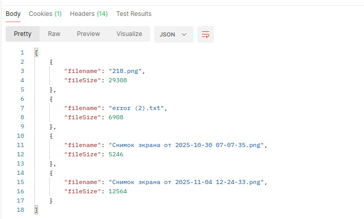
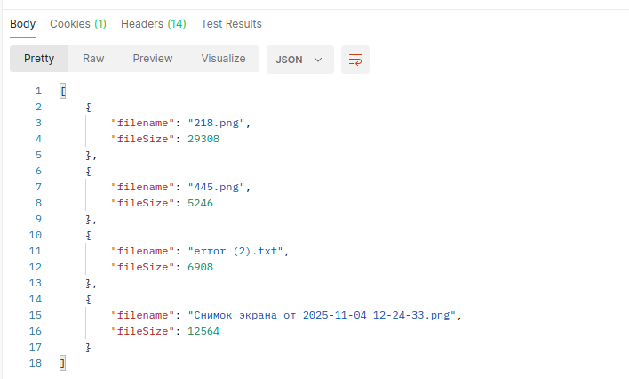
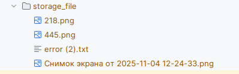
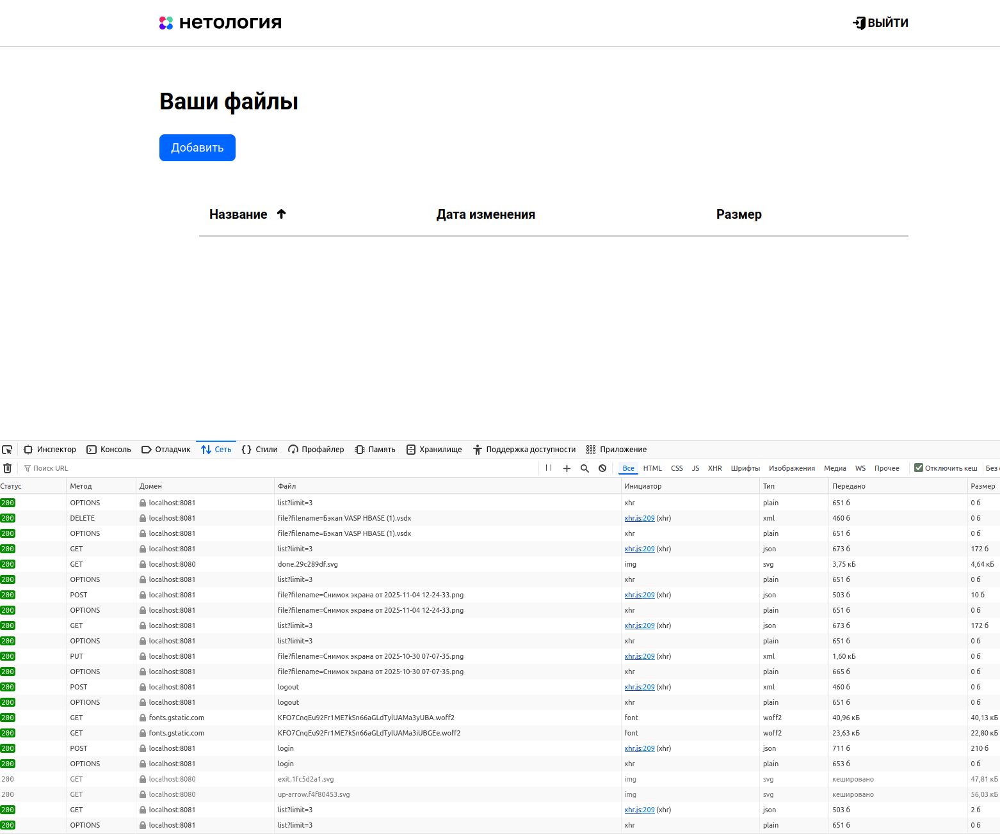
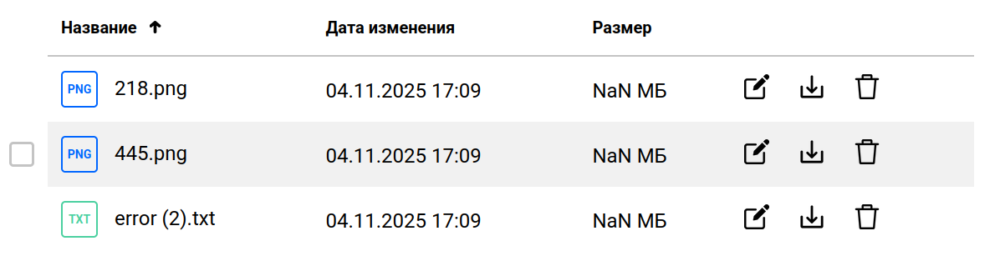
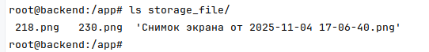

https://spring.io/guides/gs/uploading-files

# Система для хранения файлов локально на сервере

Как запустить проект:
`docker-compose up -d --build`

`jar` файл соберется внутри докера, и он запуститься на втором этапе, в мультисборке. 

После чего можно открыть в веб браузере окно фротн `http://localhost:8080/login` логин и пароль `admin`, `test`

Для хранения данных используется Postgresql в ней создается 3 таблицы:
1) Таблица для хранения юзеров (Заполняется на старте к примеру таким SQL запросом `INSERT INTO users (login, password) VALUES ('netology', 'netology');`)
2) Таблица для сохранения информации о всех фалах которые пользователь отправил на сервер
3) Таблица для сохранения о ранее выданных JWT токенах для авторизации на сервере

* Для наглядности

Итоговый результат локального тестирования:

файлы загружаются, в консоле разработчика нет ошибок
Так же через Postman можно посмотреть что файлы на сервере есть, но так как в вебе установлен лимит для 3, больше не выводить.

Изменим название файла:

Так же видим что тут поменялось название

Удаление, скачивание работает без проблем, так же нет проблем со мной пользователя, новому пользователю не будут доступны чужие файлы
Тут видно, что в консоле были старые загрузки, но при смене пользователя

Так же предыдущий юзер разлогингился, теперь ему на старый токен кидает 401
Если я снова залогинусь, все мои файлы будут доступны 

Из контейнера

